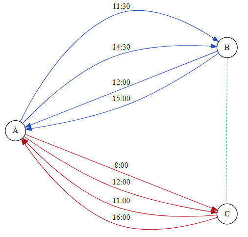

# Orient Express presents: Robust Journey Planning

### Remarks and contributors

This repository was previously hosted on [Renkulab](https://renkulab.io/) during the spring semester of 2020 for the class [EE-490(h) Lab in data science](https://edu.epfl.ch/coursebook/fr/lab-in-data-science-EE-490-H) at EPFL. Due to the class policy, only the preprocessed datasets are available on `git-lfs`, while most of the original data can be found on SBB's website. The original contributors of the project were:
- Mariko Makhmutova @marikomakhm
- Julien Salomon @jdsalomon
- Timoté Vaucher @tvaucher
- Justine Weber @JustineWeb

For the setup, we propose a local version of what we were using during the class. After cloning this repository run
```bash
conda env create -f environment.yml
conda activate sbb-robust-planer
jupyter labextension install -y --log-level=INFO jupyter-materialui
jupyter lab
```
The original version was also using Spark for the preprocessing, this is skipped in this version as it is aimed to use the interface rather than reprocessing the data

## Repository contents

We invite you to explore the design and implementation of the journey planner in the repository. 

In `notebooks/`, we provide the following notebooks documenting the design and implementation process:

- `preprocessing.ipynb`: data preprocessing of timetable data – extracting relevant data, creating and storing meaningful tables to be used in subsequent notebooks.
- `delay_analysis.ipynb`: analyzing trends in delays for each stop based on transport type and time of day
- `planning.ipynb`: constructs public transport network graph, runs simple planning algorithm, tests simple algorithm, runs delay-sensitive planning algorithm, tests delay-sensitive algorithm
- `Viz.ipynb`: contains functions related to visualizing the route planner

In `orientexpress/`, we provide the following files:

| filename     | contents                                                     |
| ------------ | ------------------------------------------------------------ |
| `delay.py`   | contains `Delay` class that allows us to calculate delays and the probability of successfully making a connection. |
| `planner.py` | contains `RoutePlanner` class that is used to get the best route from a given source to a given destination, taking into account delays and confidence. |
| `utils.py`   | utility functions for the other files.                       |

To use the visualization tool, we invite you to test the incredible implementation described below right by replacing `/lab` by `/voila` in the URL and then selecting `/notebooks/Viz.ipynb`.

## Video presentation

We invite you to see the beautifully done video presentation for the Orient Express project [here](https://youtu.be/dbYYIa_iYj0).

## A. Problem formulation

We break down the problem of building a robust transport route planner into the following phases:

1. Design and implement a public transport network model
2. Design and implement a simple route planning algorithm
3. Evaluate delay trends based on actual CFF data to model expected delay
4. Extend the simple route planning algorithm to take into consideration delays (robust route planning algorithm)
5. Test and compare the robust route planning algorithm output to real data
6. Visualize results in a way that CFF will want to employ a group of master's students

We present the approaches used as well as the reasoning in the current document, but we invite the reader to study the implementation of the solution in the repository files.

*Note: in this project, we consider journeys taken at reasonable hours of the day (7h-19h) on a typical business day, assuming the schedule of May 13-17, 2019.*

## B. Public transport network model

We chose to approach this problem with a graph-based solution. We modelled the public transport network using a directed weighted graph to be able to find transport routes using a shortest path algorithm in the graph.

Each stop in the network is represented by a node in the graph, whose identifier is the stop ID. The nodes in the network are connected with edges, each of which represents a connection between two stops: these connections can be one of two types – a *transfer* or a *trip*. 

<div style="text-align:center"></div>

<center><i>Figure 1: example of public transport network representation. Train routes are represented by blue edges, bus paths by red edges and walking transfers by dashed green edges.</i></center> 

In Figure 1 we can see that stops A and B have two train routes that go between them that each have two trips per day. Stops B and C are close enough (<500m) to have a walking transfer between them. Stops A and C have a bus route between them, that goes twice a day in each direction too. We consider the A-B and A-C edges to be *trip* edges and the B-C edge is a *transfer* edge. Each *trip* edge corresponds to a unique trip ID, and thus represents a specific transport departing at a specific time. This is a multi-edge graph and in practice we have _a lot_ of different edges between two nodes, if they are related by several transports which pass several times throughout the day.

## C. Route planning algorithm

We base our route planning algorithm on Dijkstra's shortest path algorithm. For a given departure station and arrival station, we calculate the shortest path, in terms of the time it takes to arrive at the arrival station, before a pre-specified arrival time.

Each edge, or route segment has a weight that is used when running Dijkstra's algorithm. We present the different types of edges that exist in the graph and their corresponding weight calculation methods:

1. trip from stop A to stop B (without walking transfer, e.g. stay on train): $w = t_{\text{wait for departure A}} + t_{\text{A-B trip duration}}$
2. trip from stop A to stop B (with walking transfer, e.g. change platform): $w = 120s + t_{\text{wait for departure A}} + t_{\text{A-B trip duration}}$
3. walking transfer from stop A to stop B: $w = 120s + t_{\text{walk A to B}}$
   - Only considered for stops $A$, $B$ if they are less than 500m apart in a straight line
   - $t_{\text{walk A to B}}$ is calculated as an additional 60 seconds for every 50m between $A$ and $B$.

We do not distinguish between the two different types of edges in the graph in any other way.

_Note: we set what we believe to be an appropriate upper limit for_ $t_{\text{wait for departure A}}$ _at 30 minutes._

The algorithm optimizes to minimize the total edge weight, which corresponds to taking the shortest journey between the departure and arrival stops, while satisfying the arrival time constraint.

## D. Delay modelling

### D.1. How does one measure success?

Of course, we want to take the journey that will actually get us where we want to, on time. Having calculated both the best paths and delay distributions based on time, transport time and stop identifiers, we are now equipped with the tools and knowledge that we need to make sure our passenger gets where they need to be with the likelihood that they want.

To do this, we must define a way to calculate the probability that, for a given journey, the passenger will successfully make every connection and arrive at the desired destination on time. We begin with the following **assumptions**:

1. We assume that **no external delays** may take place (tripping on a rock, petting someone's cute dog), and all sources of delays come from segments of the trip that have trip IDs.
2. We assume that **each segment of the journey is independent** of the others  – each segment with a different trip ID has a separate probability of success, where we define success as the passenger making the connection in time for the next one (or in time for the arrival time, if this is the last leg of the trip)
3. We **do not take into account negative delays**, i.e. arriving early.
4. As described in the previous section, we model delay using a parametric distribution, where the delay $d \in [0, \infty)$. We consider **delay to follow an exponential distribution** such that a trip $e_i \sim Exp(\lambda_i)$, where $\lambda_i = \frac{1}{\bar{x}_i}$ and $x_i$ is the sample mean of the delays for trip $e_i$, as calculated in the previous section.
5. We **do not take into account departure delays**, only arrival delays, because this may result in impossible and non-existent connections. 

Ultimately, we are interested in calculating the probability of successfully completing some given journey $j$ and arriving on time, denoted by $\mathbb{P}[success_j]$. For a journey to be successful, **the passenger must make all the connections**, and the **last leg of the trip must arrive before the specified arrival time** $t_{A, j}$. Without loss of generality, assuming that journey $j$ has $n$ segments, we can rewrite the probability of success as follows:
$$
\mathbb{P}[success_j] = \mathbb{P}[connection_{j, 1} \cap connection_{j, 2} \cap ... \cap connection_{j, n-1} \cap arrival_{j, n}]
$$
As we make the assumption of **independence**, we can rewrite the above expression as:
$$
\mathbb{P}[success_j] = \mathbb{P}[arrival_{j, n}] \cdot \Pi_{i=1}^{n-1} \mathbb{P}[connection_{j, i}]
$$
We define the **probability of making each connection** $i$ (with start point $a$ and end point $b$) in journey $j$ as:
$$
\mathbb{P}[connection_{j,i}] = \mathbb{P}[t_{\text{delay at a}} \leq t_{\text{departure at b}} - (t_{\text{arrival at a}} + t_{\text{transfer a to b}})]
$$
_Note: for walking connections, adapt values accordingly._

We also define the **probability of arrival at the final station**, at the $n$-th leg of journey $j$ as:
$$
\mathbb{P}[arrival_{j, n}] = \mathbb{P}[t_{delay_n} \leq t_{A, j} - t_{arrival, j, n}]
$$

Thus, we are able to determine the probability that a traveler is able to successfully complete their journey and arrive on time. We explain how we determine these probabilities in the following section.

### D.2. Analyzing actual data

In order to build a robust journey planner, we must analyze actual data to observe the trends in delays that we can use to model delay appropriately.

We use historical CFF data for 2018-2019 to study delay trends. More specifically, we note that we only consider the data before December 16, 2019 because the CFF has changed their regular timetables on that day, as stated in an [announcement](https://www.sbb.ch/fr/horaire/horaire-en-ligne/changement-d-horaire.html) on their website.

We use an exponential parametric distribution to model the delay. We choose to use an exponential distribution, based on trends observed in delay distributions when working with the data in Homework 1. To make the modelling more robust, we define a different parameter for different types of transport and times of day for each stop. We have a different parameter for each stop because each stop has a separate "environment" that has to be taken into account – for instance being located in an area next to many other stops which could cause congestion or being on a hill. We define the groupings based on the general trends and anomalies identified for each transport type and time, as well as the amount of data available for each group.

We define separate parameters for each of the following (transport type, time of day) pairs **for each stop**:

- transport type:
  - **Train**: we further consider separate categories for the most popular trains: S-Bahn (S), Intercity (IC), Eurocity (EC), InterRegio (IR), RegioExpress (RE), RegionalZug (S), Eurostar, TGV, ICE.
  - **Tram**
  - **Bus**
- time of day:
  - **morning**: 7:00 to 9:30 (peak morning commuting hours)
  - **day**: 9:30 to 16:00 (constant average delays throughout this interval)
  - **evening**: 16:00 to 19:00 (peak evening commuting hours)

We calculate the sample average $\bar{x}$ for each of the groups above, in order to obtain the parameter$\lambda = \frac{1}{\bar{x}}$ to model delay as an exponential distribution $Exp(\lambda)$. For any transport that does not fit into the above categories, for instance boats, or pairs of stop and time which do not match in our historical dataset, we have a "default delay", which is the average delay of all transportation in the dataset.

Additional measures:

- We take care to have a large sample size when modelling. To do this, we take the following measures:
  - we only take into account the time of day for bus stops if we have more than 300 samples (~number of business days in a year), so as not to incorrectly generalize for buses that are not consistently following the schedule
  - we only take into account the train type for the previously identified trains if we have more than 300 samples, again to avoid incorrectly generalizing for special trains that may not be on the regular schedule
  - having observed the dataset, all combination of tram stops and times (morning, day, evening) have over 400 samples, so we do not need to consider further robustness measures

## E. Robust route planning algorithm

To make the route planning algorithm robust, we take into account the probability of successfully completing a journey. If the probability of success for a given trip does not pass the minimum threshold, we consider alternative paths, hoping to find a path that will be sufficiently likely to succeed for the traveler.

When considering alternative routes, we follow an order of priority:

1. Latest departure time
2. Highest probability of success
3. Minimal number of connections between transport
4. Minimal number of walking connections

We present an overview of the robust version algorithm, with a minimal probability of success $p$:

- Find a path $r$ using Dijkstra's algorithm as described in section C.
- If the probability of $r$ succeeding is higher than $p$, try to improve $r$:
    1. Remove edges one at a time, find a path that is as fast, but may have higher success probability or fewer transfers
    2. Try to make arrive a bit earlier (5, 10, ..., 25 minutes) and check if there's a solution that leaves at the same time as above, but would improve on the other metrics
    3. Return the best candidate found
- Otherwise, incrementally block the least probable trips (the least probable, then the 2 least probable, ...) of $r$ from the graph and try again.
    - Once an iteration is completed, we block all current trips, so that we build solution that would leave incrementally earlier and the algorithm wouldn't retry paths that we know aren't sufficiently robust.
    - We also try to block walk transfers (one by one) as this has empirically shown that it yielded impressive results on some paths, but don't add them in the list of blocked trips at the end of the iteration as you can walk at anytime from A to B.
    - One iteration is $\mathcal{O}(\#\text{trips} + \#\text{walking transfers})$ call to the shortest path algorithm.
- Repeat until paths with probability at least $p$ are found, or until the maximum number of iterations is exceeded (20 by default)
- Return the fastest path found in the successful iteration, otherwise, return the most robust path found during the procedure.

_Note: we don't let users to set the probability of success to less than 50% because here, at Orient Express, our team cares about our clients so we don't want to propose solutions that work less than half the time._

## F. Pros, cons and further improvements

#### Pros:

- The algorithm works consistently
- We provide similar results to the CFF or sometimes better ones (although Google Maps finds these optimal results too)
- We were able to optimize the algorithm to reduce the amount of walking required

#### Cons:

- Delay tends to be overestimated with our parametric distribution
- Delay calculations are not very accurate for transport that uses the default delay parameter (transport that we do not have much data for) 

#### Further improvements:

- Modeling delay more precisely, recalculating each percentile for each stop, based on actual data, rather than using a parametric distribution to model delay, as it tends to overestimate delays. However, this would come at the cost of increased computation time.
- Adapting walking speed for transfers, especially for peak hours.
- Adapting walking transfers time, using the available transfer table available for known connections.
